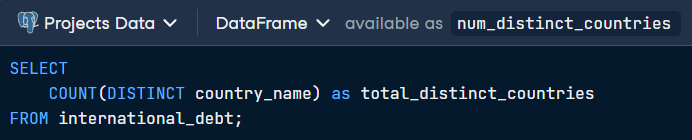
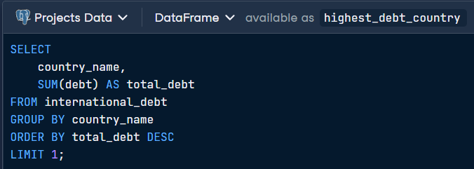
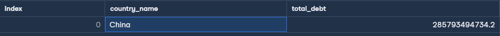
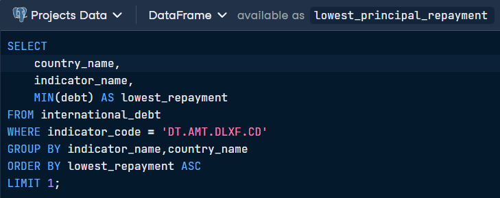
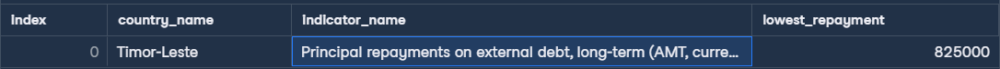

# 💵 Analyze International Debt Statistics

> **Objective:** Extract and analyze international debt data to identify global debt distribution, the highest-indebted nations, and specific repayment indicators.

This project explores a dataset provided by The World Bank containing debt information for developing countries. Using PostgreSQL, I transformed raw financial records into a concise summary to identify which countries hold the most significant debt burdens and their specific repayment obligations.

## Data description
| Column         | Definition                                                                | Data type  |
| -------------  | ----------------------------------------------------------                | ---------- |
| country_name   | Name of the country                                                       | varchar    |
| country_code   | Code representing the country                                             | varchar    |
| indicator_name | Description of the debt indicator                                         | varchar    |
| indicator_code | Code representing the debt indicator                                      | varchar    |
| debt           | Value of the debt indicator for the given country (in current US dollars) | float      |

## First SQL Query 

## Output

## Second SQL Query 

## Output

## Third SQL Query

## Output

## Key Insights 
* Global Scope: The database covers 124 distinct countries, providing a broad view of the developing world's financial landscape.
* Economic Concentration: China was identified as the country with the highest total debt, significantly outpacing other developing nations in total volume.
* Repayment Minimums: Timor-Leste reports the lowest principal repayment for long-term external debt, indicating a smaller scale of long-term borrowing compared to industrial giants.

