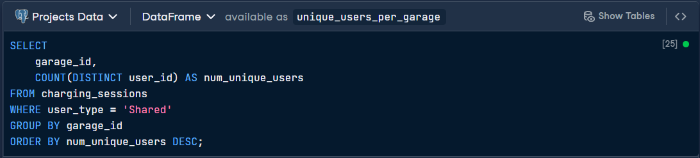
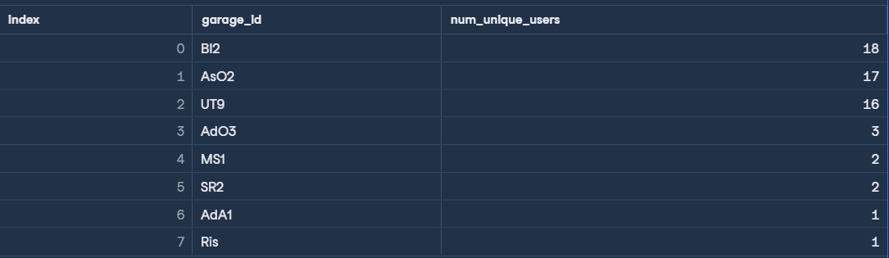
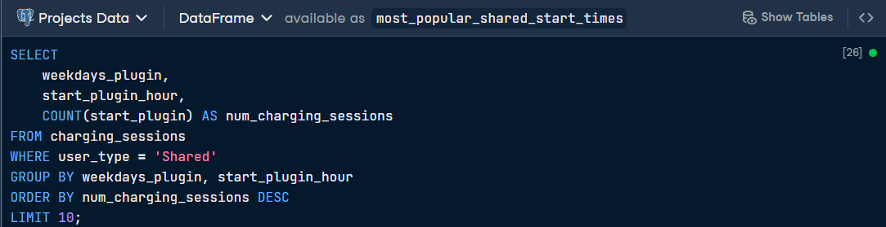
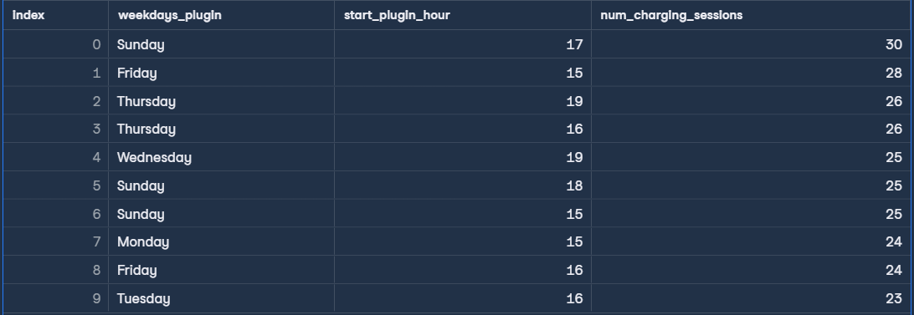
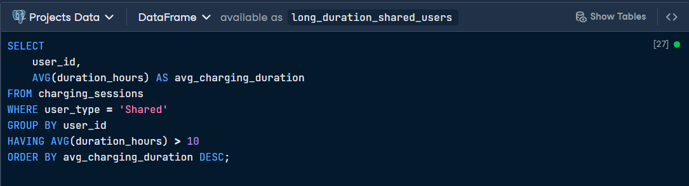
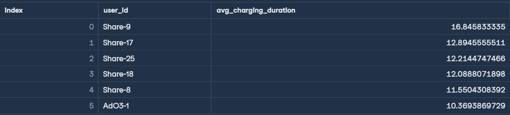

# 🔌Analyzing Electric Vehicle Charging Habits

> **Objective:** To analyze electric vehicle (EV) charging behavior in shared apartment garages, identifying user traffic, peak usage times, and high-duration charging habits to help managers optimize port availability.

This project utilizes a PostgreSQL database containing records of charging sessions. By filtering for "Shared" station types, the analysis focuses on community ports where competition is highest, providing actionable insights into when and how these resources are utilized.

## Data description
| Column | Definition | Data type |
| :--- | :--- | :--- |
| garage_id | Identifier for the garage/building | VARCHAR |
| user_id | Identifier for the individual user | VARCHAR |
| user_type | Indicating whether the station is `Shared` or `Private` | VARCHAR |
| start_plugin | The date and time the session started | DATETIME |
| start_plugin_hour | The hour (in military time) that the session started | NUMERIC |
| end_plugout | The date and time the session ended | DATETIME |
| end_plugout_hour | The hour (in military time) that the session ended | NUMERIC |
| duration_hours | The length of the session, in hours | NUMERIC |
| el_kwh | Amount of electricity used (in Kilowatt hours) | NUMERIC |
| month_plugin | The month that the session started | VARCHAR |
| weekdays_plugin | The day of the week that the session started | VARCHAR |

## First SQL Query 
Goal: Find the number of unique individuals using each garage's shared charging stations.

## Output

## Second SQL Query 
Goal: Find the top 10 most popular charging start times (weekday + hour) for shared stations.

## Output

## Third SQL Query
Goal: Identify users whose average charging duration exceeds 10 hours at shared stations.

## Output

## Key Insights 
* User Concentration: Garage Bl2 has the highest traffic with 18 unique users, followed closely by AsO2 (17) and UT9 (16). Managers should prioritize these locations for infrastructure upgrades.
* Peak Demand Windows: Peak usage occurs on Sunday at 17:00 (5 PM). In general, late afternoon and early evening (15:00 - 19:00) across Sundays and Fridays are the busiest times for shared ports.
* Duration Outliers: User Share-9 is a significant outlier, averaging nearly 17 hours per session. Identifying such users helps in implementing policies to prevent port hogging in shared spaces.

