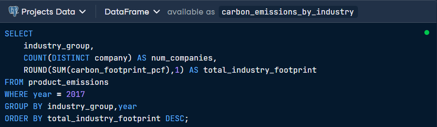
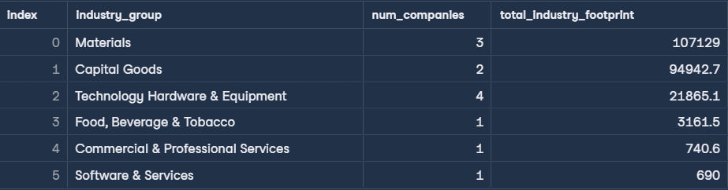

## 🏭 Analyzing-Industry-Carbon-Emissions

> **Objective:**

## Data description
| Column         | Data type  |
| -------------  | ---------- |
| id             | varchar    |
| year           | int        |
| product_name   | varchar    |
| company        | varchar    |
| country        | varchar    |
| industry_group | varchar    |
| weight_kg      | numeric    |
| carbon_footprint_pcf | varchar    |
| upstream_percent_total_pcf             | varchar    |
| operations_percent_total_pcf            | varchar    |
| downstream_percent_total_pcf            | varchar    |

## SQL Query 

## Output

## Key Insights 
*

