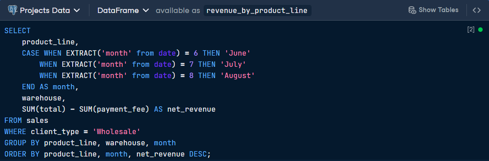
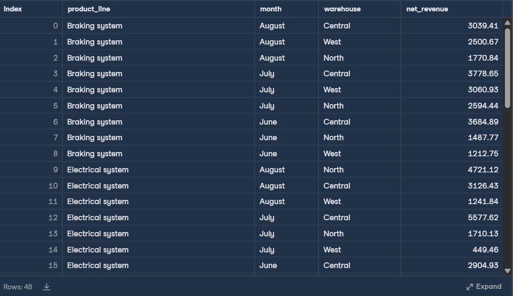

# 🛣️ Analyzing Motorcycle Part Sales
This project analyzes wholesale sales data from a motorcycle parts company to identify net revenue trends across different product lines, months, and warehouse locations. 
By filtering for wholesale transactions and accounting for varying payment fees, the analysis provides the board of directors with a data-driven understanding of regional profitability and inventory performance.

# Data description
| Column Name | Data Type | Description |
| :--- | :--- | :--- |
| **order_number** | VARCHAR | Unique order number. |
| **date** | DATE | Date of the order, from June to August 2021. |
| **warehouse** | VARCHAR | The warehouse that the order was made from— North, Central, or West. |
| **client_type** | VARCHAR | Whether the order was Retail or Wholesale. |
| **product_line** | VARCHAR | Type of product ordered. |
| **quantity** | INT | Number of products ordered. |
| **unit_price** | FLOAT | Price per product (dollars). |
| **total** | FLOAT | Total price of the order (dollars). |
| **payment** | VARCHAR | Payment method—Credit card, Transfer, or Cash. |
| **payment_fee** | FLOAT | Percentage of total charged as a result of the payment method. |

# SQL Query: Wholesale Net Revenue by Product Line
>The following code calculates the monthly net revenue for each product line and warehouse.

# Output Results

# Key Insights
* **Top Performing Categories**: By sorting by net_revenue DESC, the board can immediately see which product lines (e.g., "Electrical system" or "Braking system") dominate wholesale income.

* **Warehouse Efficiency**: The grouping reveals if a specific warehouse (like "Central") consistently outperforms others in specific months.

* **Profitability Trends**: The month-to-month breakdown helps identify seasonal shifts in demand for different motorcycle parts.

