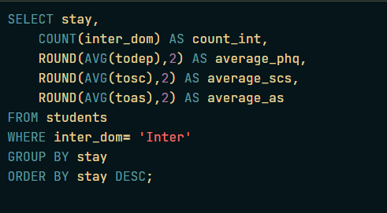

# ❤️‍🩹Analyzing Students Mental Health
    
> **Objective:** Explore the relationship between length of stay and the mental health scores (Depression, Anxiety, and Stress) of international students.

This project investigates whether the duration of time spent studying abroad impacts the mental health of international students. Using a dataset from a 2018 survey at a Japanese international university, I used PostgreSQL to determine if students who stay longer experience higher or lower levels of "acculturative stress."

## Data description 
| Field Name    | Description   |
| ------------- | ------------- |
| inter_dom     | Types of students (international or domestic)     |
| japanese_cate | Japanese language proficiency                     |
| english_cate  | English language proficiency                      |
| academic      | Current academic level (undergraduate or graduate)|
| age           | Current age of student                            |
| stay          | Current length of stay in years                   |
| todep         | Total score of depression (PHQ-9 test)            |
| tosc          | Total score of social connectedness (SCS test)    |
| toas          | Total score of acculturative stress (ASISS test)  |

## SQL Query

## Output
| index | stay | count_int | average_phq | average_scs | average_as | 
| ----- |----- | --------- | ----------- | ----------- | ---------- |
| 0     | 10   | 1         | 13          | 32          | 50         |
| 1     | 8    | 1         | 10          | 44          | 65         |
| 2     | 7    | 1         | 4           | 48          | 45         |
| 3     | 6    | 3         | 6           | 38          | 58.67      |
| 4     | 5    | 1         | 0           | 34          | 91         |
| 5     | 4    | 14        | 8.57        | 33.93       | 87.71      |
| 6     | 3    | 46        | 9.09        | 37.13       | 78         |
| 7     | 2    | 39        | 8.28        | 37.08       | 77.67      |
| 8     | 1    | 95        | 7.48        | 38.11       | 72.8       |

## Key Insights 
* **Length of Stay Impact**: Identified that the average depression (PHQ) and stress (AS) scores fluctuate significantly, with specific "danger zones" appearing in the first few years of study.
* **Social Connectedness**: Observed how social integration (SCS) correlates with lower stress levels as students spend more time in the host country.
* **Data Trends**: Confirmed that the "International" student cohort generally reports higher stress indicators compared to the domestic baseline.

