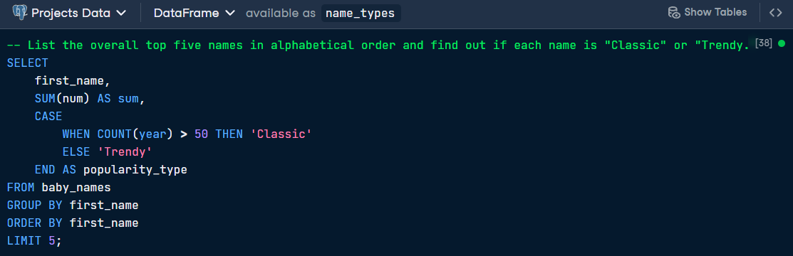
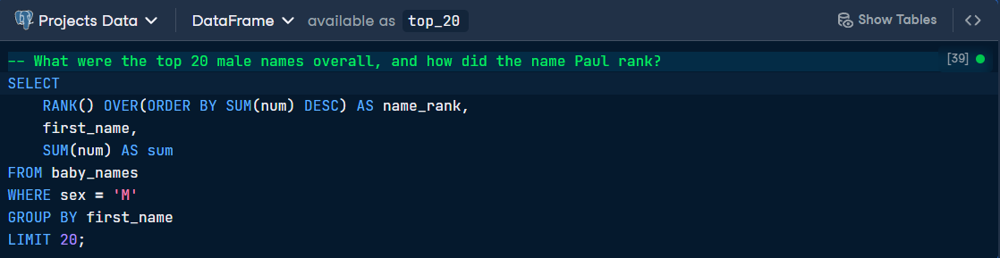
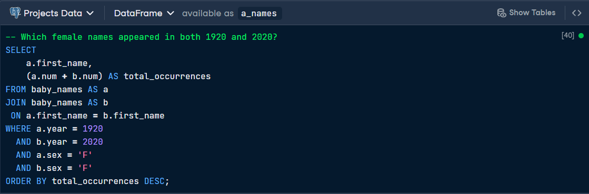

## 👶Exploring Trends in American Baby Names

**Objective:** Analyze a century of American baby name data to distinguish between "Classic" and "Trendy" names and identify long-term popularity shifts.

This project examines data from the United States Social Security Administration spanning 1920 to 2020. Using SQL, I classified names based on their longevity and tracked how specific names have survived over 100 years of changing cultural tastes, focusing on names with high-volume usage (over 5,000 babies per year).

## Data description
| Column         | Definition                                                                | Data type  |
| -------------  | ----------------------------------------------------------                | ---------- |
| year           | Year                                                                      | int        |
| first_name     | First name                                                                | varchar    |
| sex            | Sex of babies given first_name                                            | varchar    |
| num            | Number of babies of sex given first_name in that year                     | int        |

## First SQL Query 
> List the first five names in alphabetical order and find out if each name is "Classic" or "Trendy."

## Output

## Second SQL Query 
> Find the top 20 male names overall and how did the name Paul rank.

## Output

## Third SQL Query 
> Find the female names that appeared in both 1920 and 2020.

## Output

## Key Insights 
* The Longevity of "A" Names: In the initial alphabetical sweep, names like Aaron achieved "Classic" status with over 530,000 occurrences, while others like Aaliyah and Abigail are categorized as "Trendy" despite significant volume.
* Dominant Male Staples: The top of the male rankings is dominated by biblical and traditional names; James, John, and Robert each boast over 4.4 million occurrences over the last century.
* Timeless Female Names: Names such as Evelyn and Elizabeth show remarkable staying power, appearing with high frequency in both 1920 and 2020, bridging a 100-year gap in naming trends.

