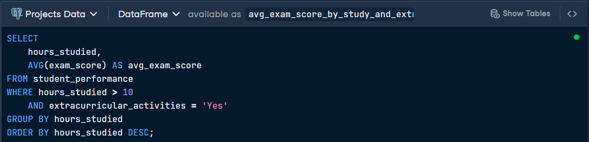
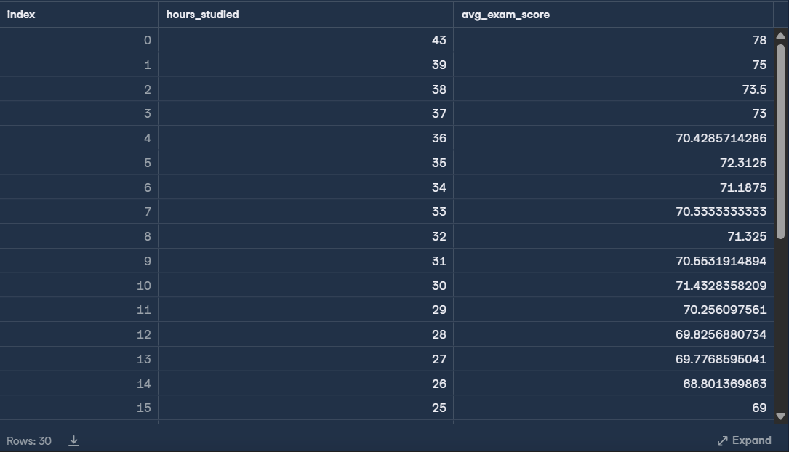
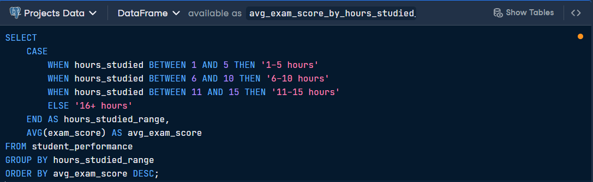
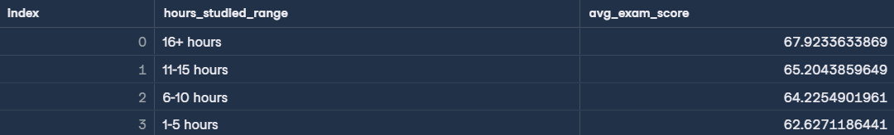
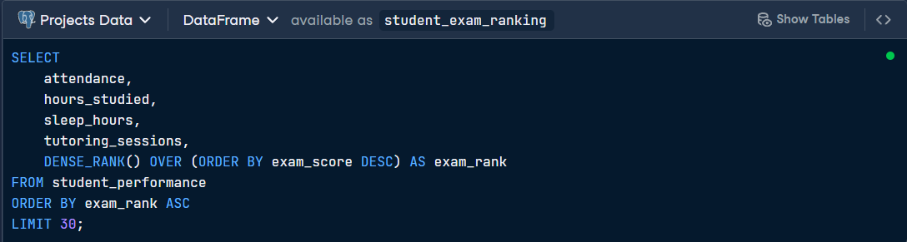
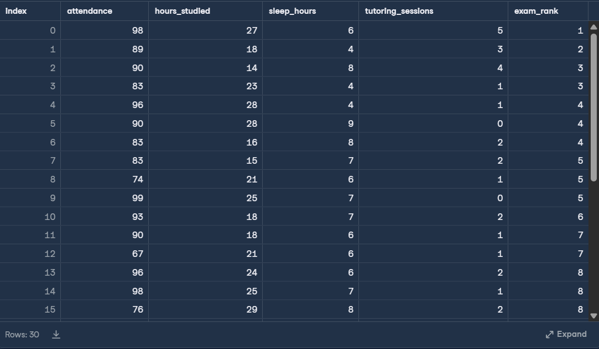

# 🎓 Factors that Fuel Student Performance
This project analyzes a comprehensive dataset to identify the lifestyle habits and academic behaviors—such as study duration, sleep patterns, and tutoring—that most significantly impact student exam performance.
By leveraging intermediate SQL queries, the analysis provides data-driven insights to help students and educators make informed decisions for optimizing academic success

## Data description
| Column Name | Definition | Data Type |
| :--- | :--- | :--- |
| **attendance** | Percentage of classes attended | float |
| **extracurricular_activities** | Participation in extracurricular activities (Yes, No) | varchar |
| **sleep_hours** | Average number of hours of sleep per night | float |
| **tutoring_sessions** | Number of tutoring sessions attended per month | integer |
| **teacher_quality** | Quality of the teachers (Low, Medium, High) | varchar |
| **exam_score** | Final exam score | float |

## First SQL Query: High-Study Students with Extracurricular Activities                
> This query focuses on students studying over 10 hours who also participate in extracurriculars.

## Output Results

## Second SQL Query: Impact of Study Hours on Average Scores               
> This query buckets students into study ranges to visualize the direct benefit of increased study time.

## Output Results

## Third SQL Query: Identifying the Top 30 Students 
>This code ranks students by their exam scores and displays their associated habits.

## Output Results

## Key Insights 
* **The Power of 16+ Hours**: Students studying more than 16 hours achieved the highest average scores (~67.92), significantly higher than the 1-5 hour group (~62.63).
* **The Rest Factor**: Data in the top rankings shows that even top-ranked students (Rank 1-3) vary in sleep (4 to 8 hours), suggesting tutoring and study hours may sometimes compensate for less sleep, though 6-8 hours remains common among high scorers.
* **Extracurricular Synergy**: Students who study heavily (>10 hours) and participate in extracurriculars maintain very high average scores, often exceeding 70.0 in the 30+ hour study range.

