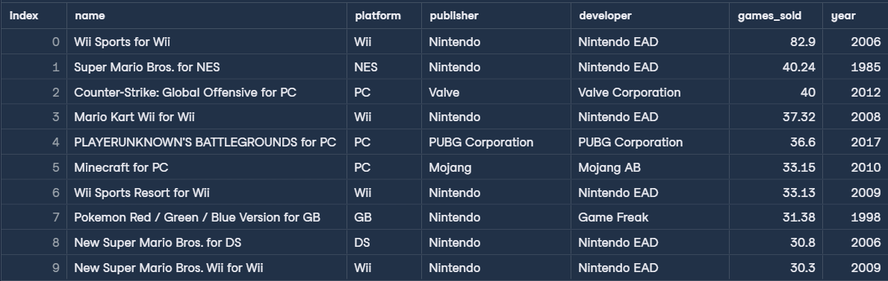
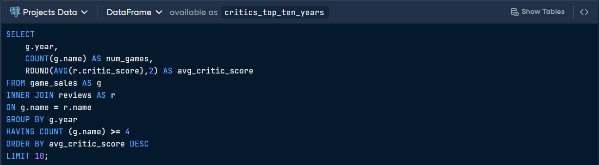
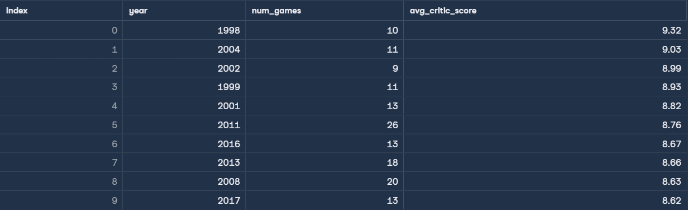
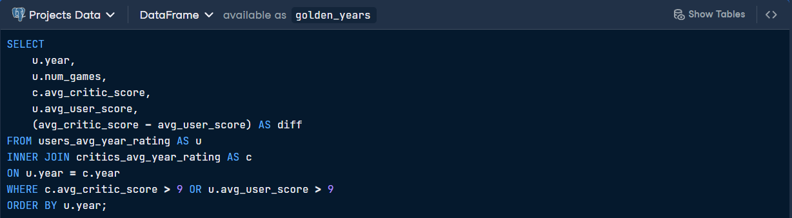
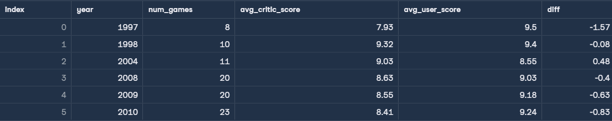
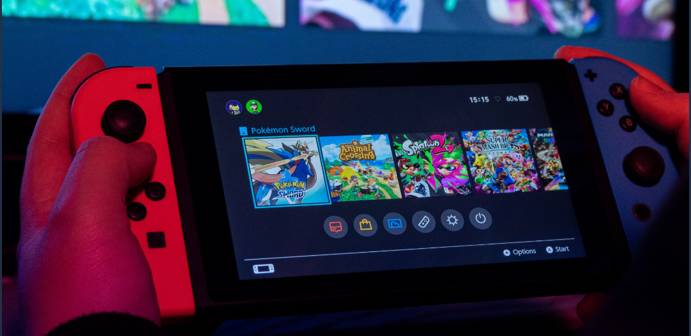

# 🎮 When Was the Golden Age of Video Games?
Objective: Analyze a century of gaming data to identify the "Golden Age" of video games by comparing critic and user reviews against global sales figures.

This project explores the business and cultural impact of the gaming industry. By joining review datasets with sales records, I identified the specific years that resonated most with players and critics alike, exploring whether higher budgets and modern technology lead to better-received games.

## Data description
* `game_sales` table:

| Column | Definition | Data Type |
|-|-|-|  
|name|Name of the video game|varchar|
|platform|Gaming platform|varchar|
|publisher|Game publisher|varchar|
|developer|Game developer|varchar|
|games_sold|Number of copies sold (millions)|float|
|year|Release year|int|

* `reviews` table

| Column | Definition | Data Type |
|-|-|-|
|name|Name of the video game|varchar|  
|critic_score|Critic score according to Metacritic|float|
|user_score|User score according to Metacritic|float|

* `users_avg_year_rating` table

| Column | Definition | Data Type |
|-|-|-|
|year| Release year of the games reviewed |int|  
|num_games| Number of games released that year |int|
|avg_user_score| Average score of all the games ratings for the year |float|

* `critics_avg_year_rating` table

| Column | Definition | Data Type |
|-|-|-|
|year| Release year of the games reviewed |int|  
|num_games| Number of games released that year |int|
|avg_critic_score| Average score of all the games ratings for the year |float|

## First SQL Query 
> Identify the ten best-selling video games of all time in this dataset.

## Output

## Second SQL Query 
> Find the ten years with the highest average critic scores.

## Output

## Third SQL Query 
> Locate the "Golden Years" where both critics and users gave exceptionally high ratings.

## Output

**Key Insights**
* The Dominance of Nintendo: Looking at the top 10 best-selling games, Nintendo titles like Wii Sports, Super Mario Bros., and Mario Kart hold the majority of spots, showcasing the brand's historic market power.
* The Critic's Peak: 1998 was identified as a standout year for quality, with an average critic score of 9.32 across 10 major releases.
* The Great Convergence: 1998 also appears in the "Golden Years" list with a very small difference between critic and user scores (-0.08), indicating a rare moment in history where professional reviewers and the general public were in almost perfect agreement on game quality.

