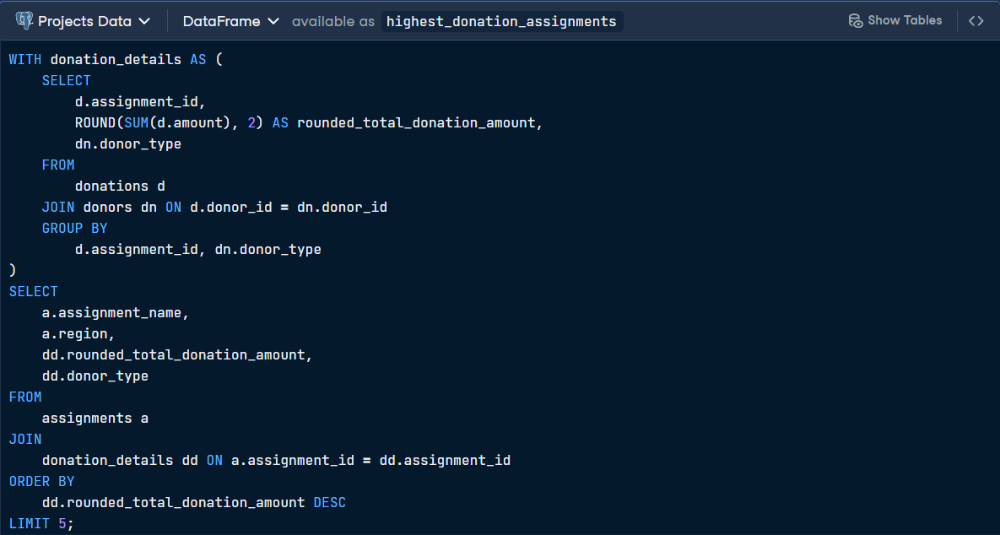
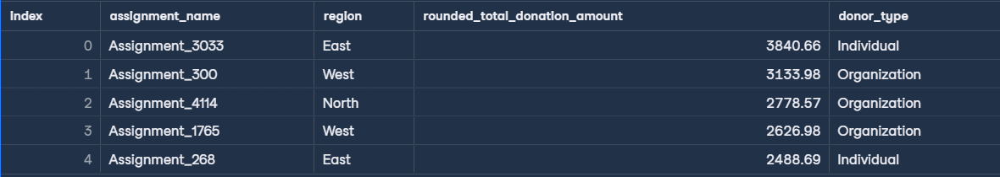
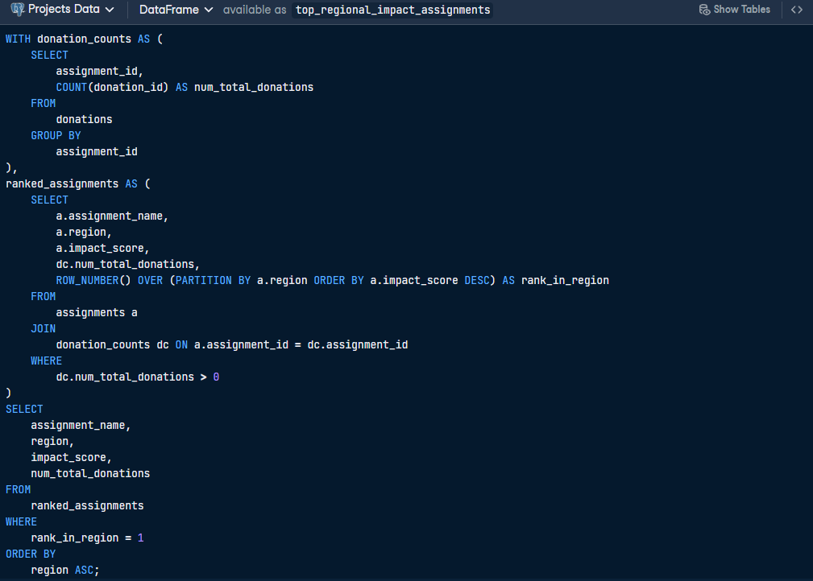
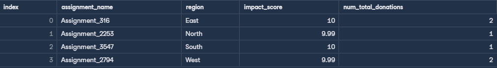

# 🫶 Impact Analysis of GoodThought NGO Initiatives
In this project, i analyzed 13 years of humanitarian funding data to reveal that top-performing projects hit near-perfect impact scores (9.99–10) with just 1–2 donations — a clear signal of high resource efficiency to guide future funding decisions

## Data description
* **Assignments:** Details about each project, including its name, duration, budget, geographical region, and the impact score.
* **Donations:** Records of financial contributions, linked to specific donors and assignments, highlighting how financial support is allocated and utilized.
* **Donors:** Information on individuals and organizations that fund GoodThought’s projects, including donor types.

## ERD diagram 

## First SQL Query: Top Donations by Donor Type                     
> This query identifies the top five assignments based on total donation value, broken down by the type of donor.

## Output Results

## Second SQL Query: Top Regional Impact                  
> This query identifies the assignment with the highest impact score in each region, ensuring only projects that received at least one donation are included.

## Output Results

## Tools & Technology
* **Database:** PostgreSQL
* **Techniques:** Aggregate functions, JOINs, window functions, CTEs
  
## Key Insights 
* **Funding Dominance:** Organizations are major contributors to high-value projects in the North and West regions, while Individuals lead the highest-funded assignments in the East.

* **High-Impact Success:** GoodThought NGO has successfully achieved perfect or near-perfect impact scores (9.99–10) across all operational regions (East, North, South, and West).

* **Efficiency:** Top-impact projects often achieve their goals with a relatively low number of total donations (1–2), suggesting high resource utilization efficiency.

