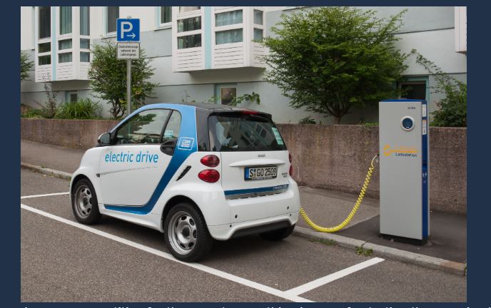

#   SQL Projects

## 1. Analyzing Students Mental Health
This project investigates whether the duration of time spent studying abroad impacts the mental health of international students. Using a dataset from a 2018 survey at a Japanese international university, I used PostgreSQL to determine if students who stay longer experience higher or lower levels of "acculturative stress."

---
## 2. Analyze International Debt Statistics
This project explores a dataset provided by The World Bank containing debt information for developing countries. Using PostgreSQL, I transformed raw financial records into a concise summary to identify which countries hold the most significant debt burdens and their specific repayment obligations.

---
## 3. Analyzing Industry Carbon Emissions
This project investigates the greenhouse gas emissions attributable to various products, from food to technology. Using a dataset of Product Carbon Footprints (PCFs) measured in CO2 equivalents, I used PostgreSQL to aggregate industry-wide emissions, highlighting which sectors contribute most significantly to global carbon output. 

---
## 4. Analyzing Electric Vehicle Charging Habits
This project utilizes a PostgreSQL database containing records of charging sessions. By filtering for "Shared" station types, the analysis focuses on community ports where competition is highest, providing actionable insights into when and how these resources are utilized.

---
