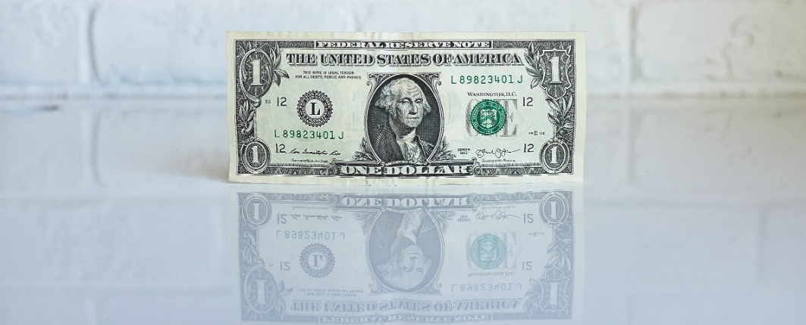
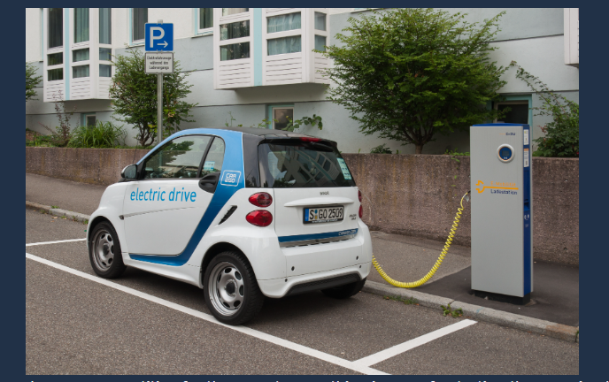

#   SQL Projects

---
## 1. Impact Analysis of GoodThought NGO Initiatives

---
## 2. Analyzing Industry Carbon Emissions
This project investigates the greenhouse gas emissions attributable to various products, from food to technology. Using a dataset of Product Carbon Footprints (PCFs) measured in CO2 equivalents, I used PostgreSQL to aggregate industry-wide emissions, highlighting which sectors contribute most significantly to global carbon output. 

---
## 4. Analyzing Electric Vehicle Charging Habits
This project utilizes a PostgreSQL database containing records of charging sessions. By filtering for "Shared" station types, the analysis focuses on community ports where competition is highest, providing actionable insights into when and how these resources are utilized.

---
